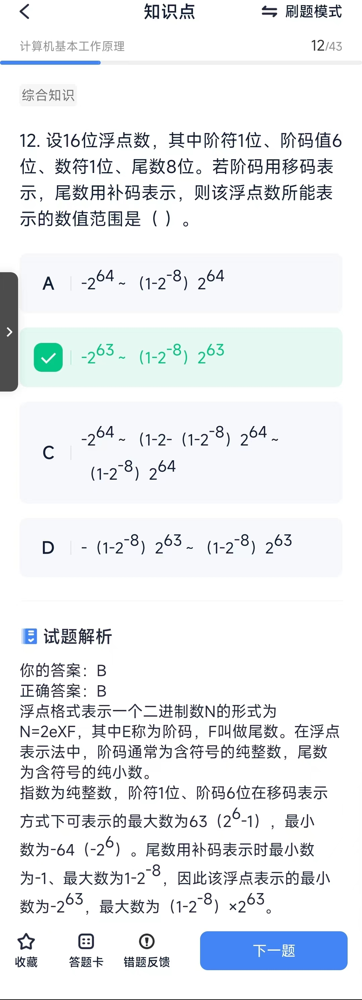

[TOC]
# 计算机基本工作原理

## 校验方法
* 循环冗余校验CRC:
* 海明码：
* 奇偶校验码：

海明码（Hamming Code）是一种错误检测和纠正的编码方法，广泛用于数字通信和存储系统中，特别是在RAM等存储设备中，以确保数据的完整性和可靠性。

海明码的特点：
* 单比特错误检测和纠正：海明码可以检测并纠正一个比特的错误。
* 奇偶校验位：海明码通过添加奇偶校验位来实现错误检测和纠正。
* 冗余性：为了实现错误检测和纠正，海明码在原始数据中添加了额外的冗余比特。

概念：
* 海明不等式：校验码个数为k，2的k次方个校验信息，1个校验信息用来指出“没有错误”，满足m+k+1<=2^k。所以32位的数据位，需要6位校验码。
* 码距最小为2n+1
* 海明码中的任一位都是由若干个校验位来校验的。其对应关系如下：被校验的海明位的下标等于所有参与校验该位|的校验位的下标之和，而校验位则由自身校验。

## 补码、浮点数等运算
### 补码

#### 定义
补码（Two's complement）是计算机中表示有符号整数的一种方法。在补码表示法中，正数与其二进制表示完全相同，而负数则是其绝对值的二进制表示取反后加1。

补码的特点如下：

正数：正整数的补码与其原码（即二进制表示）相同。

负数：负整数的补码是其绝对值的二进制表示取反后加1。

计算步骤：

取负数的绝对值的二进制表示。
对所有位取反（0变1，1变0）。
将结果加1。

#### 示例：

我们以8位补码为例来计算-5的补码：

-5的绝对值为5，其8位二进制表示是：00000101。
对所有位取反得到：11111010。
加1得到补码：11111011。
所以，-5的8位补码是11111011。

补码的优点是可以方便地进行加法运算，无需特殊处理正负数，只需进行标准的二进制加法即可。

#### 概念
在计算机中，n位补码（表示数据位），表示范围是-2的n-1次方~2的n-1次方-1，其中最小值为人为定义，以n=8为例，其中-128的补码是人为定义的10000000

### 浮点数
#### 定义
浮点数是计算机中用于表示实数（即有小数点的数）的数据类型。

#### 概念
* 相加：两个浮点数相加 需要先对其小数点，在相加尾数；即先对阶，将小阶向大阶对齐，同时将尾数右移n位

* 浮点数范围：

## 计算机组成
* CPU访问速度：通用寄存器存取最快，其次Cache, 再次内存的存取，访问速度最慢的是作为外存的硬盘
* 三总线：数据总线、地址总线、控制总线

### 常用运算器
* 程序计数器：是一个中央处理器CPU中的寄存器，其功能是存储下一条要执行的指令（在机器语言中）的内存地址
* 加法器 算术逻辑单元，简称ALU，是计算机的数学大脑，也就是计算机里负责运算的组件。 
* 指令寄存器：在计算机科学中是中央处理器中控制单元用来存储执行中指令的寄存器。在简易的处理器中，每个将被执行的指令都会被存入指令寄存器中。从解码、准备到执行完成的过程中都会被持续的保存；其位数取决于指令字长(对用户完全透明)
* 指令译码器：指令译码器(Instruction Decoder,ID)是控制器中的主要部件之一。计算机能且只能执行“指令”。指令由操作码和地址码组成。操作码表示要执行的操作性质，即执行什么操作，或做什么；地址码是操作码执行时的操作对象的地址。
* 地址寄存器：保存当前CPU所访问的内存单元地址
* 状态寄存器：状态寄存器又称cpsr，是cpu运算器的一部分。主要存放两类信息：

1、存放当前指令执行结果的各种状态或条件码，结果是否为负、是否为0、是否进位、是否溢出；
2、存放控制信息，有终端标志位、跟踪标志位。
* 通用寄存器：通用寄存器可用于传送和暂存数据，也可参与算术逻辑运算，并保存运算结果。
* 累加寄存器：累加寄存器（Accumulator register）通常简称为累加器，它是一个通用寄存器。其功能是：当运算器的算术逻辑单元(ALU)执行算术或逻辑运算时，为ALU提供一个工作区。