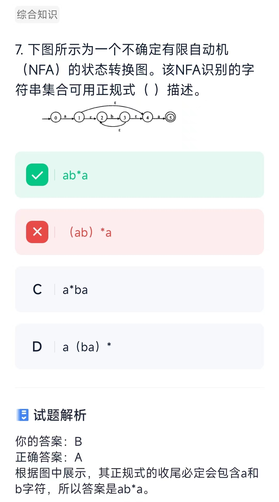
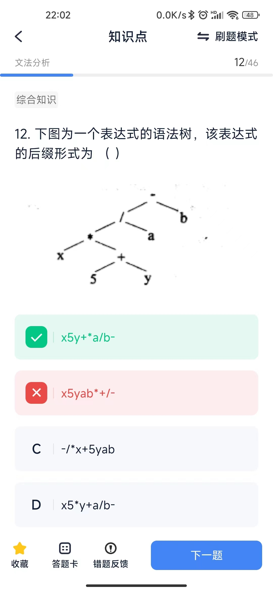

# 文法分析
## 概念
* 乔姆斯基（Chomsky）将文法分为4种类型，程序设计语言的大多数语法现象可用其中的**上下文无关文法**描述。
* 对高级语言源程序进行编译（或解释）方式的翻译过程中，语法分析的任务是根据语言的语法规则，分析单词串是否构成短语和句子，即表达式、语句和程序等基本语言结构，同时检查和处理程序中的语法错误。程序设计语言的绝大多数语法规则可以采用上下文无关文法进行描述。语法分析方法有多种，根据产生语法树的方向，可分为自底向上和自顶向下两类。递归下降分析法和预测分析法是常用的自顶向下分析法。算符优先分析法和LR分析法属于自底向上的语法分析方法。

* 语言中具有独立含义的最小语法单位是符号（单词），如标识符、无符号常数与界限符等。词法分析的任务是把构成源程序的字符串转换成单词符号序列。 有限自动机是一种识别装置的抽象概念，它能准确地识别正规集。有限自动机分为两类：确定的有限自动机（DFA）和不确定的有限自动机（NFA）。

## 计算题
* 10个成员组成的开发小组，若任意两人之间都有沟通路径，则一共有**45**条沟通路径
> 沟通路径公式如下：M=n*(n-1)/2 
* 后缀表达式abc-+d* ，从左到右依次扫描，对应表达式为：(a+(b-c))*d

* NFA

* AST
