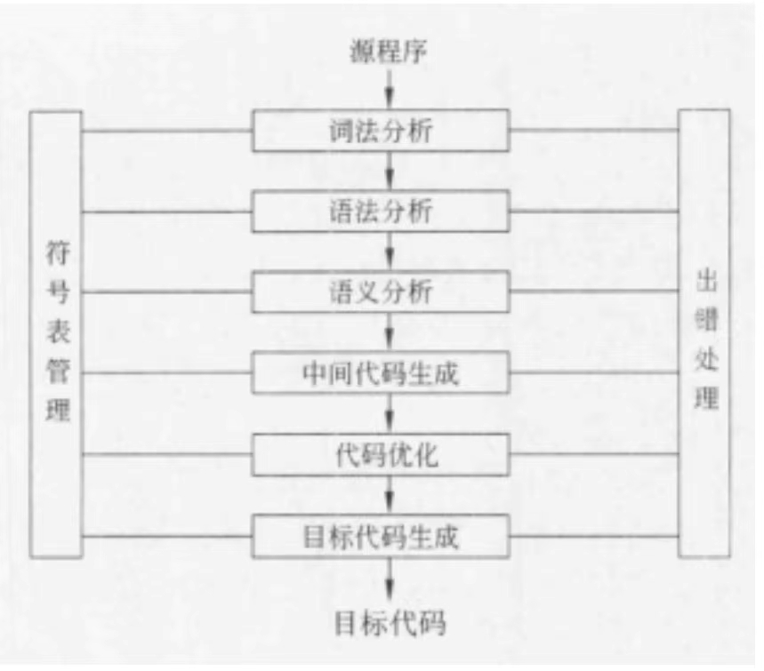
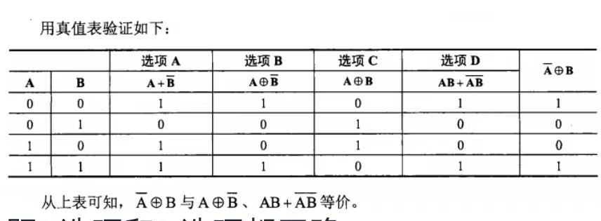
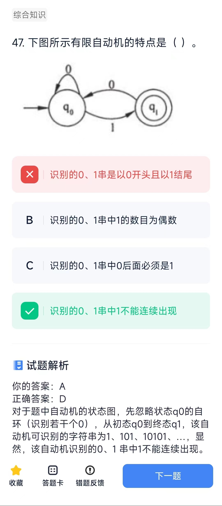

# 程序设计语言基本概念

## 概念
* 程序设计语言的基本成分包括数据、运算、控制和传输等。 程序设计语言的控制成分包括顺序、选择和循环3种结构。
* 引用调用，会改变形参的值；值调用，不会改变形参的值
1. 在传值调用方式下，实参可以是变量， 也可以是常量和表达式 
2. 在引用调用方式下，可以实现形参和实 参间双向传递数据的效果
* 语法制导翻译是一种静态语义分析方法
* 解释程序也称为解释器，它可以直接解释执行 源程序，或者将源程序翻译成某种中间表示形 式后再加以执行； 而编译程序（编译器）则首 先将源程序翻译成目标语言程序，然后在计算 机上运行目标程序。这两种语言处理程序的根本区别是：在编译方式下，机器上运行的是与 源程序等价的目标程序，源程序和编译程序都 不再参与目标程序的执行过程：而在解释方式下，解释程序和源程序（或其某种等价表示） 要参与到程序的运行过程中，运行程序的控制 权在解释程序。解释器翻译源程序时不产生独 立的目标程序，而编译器则需将源程序翻译成独立的目标程序。 分阶段编译器的工作过程如下图所示。其中， **中间代码生成和代码优化**不是必须的。

> 将高级语言程序翻译为机器语言程序的过程中，需要依次进行词法分析、语法分析、语义分析、中间代码生成、代码优化和目标代码生成等阶段，其中，中间代码生成和代码优化可以省略。程序中的错误分为语法错误和语义错误，语法分析阶段不能发现语义错误。 语义分析阶段主要处理语法正确的语言结构的含义信息，可以与目标机器的体系结构无关。目标代码生成阶段的工作与目标机器的体系结构是密切相关的。
> 词法分析阶段依据语言的词法规则，对源程序进行逐个字符地扫描，从中识别出一个个“单词”符号，主要是针对词汇的检查。 
> 语法分析的任务是在词法分析的基础上，根据语言的语法规则将单词符号序列分解成各类语法单位，如“表达式”“语句”和“程序”等。语法规则就是各类语法单位的构成规则，主要是针对结构的检查。 主要分析程序语句的结构是否合法
> 语义分析阶段分析各语法结构的含义，检查源程序是否包含语义错误，主要针对句子含义的检查。 
> 目标代码生成是编译器工作的左后一个阶段，任务是把中间代码变换成特定机器上的决定指令代码、可重定位的指令代码或汇编指令代码，这个阶段的工作与具体的集器密切相关。分配寄存器在这个阶段

* 程序运行时的用户内存空间一般划分为代码区、静态数据区、栈区和堆区，其中栈区和堆区也称为动态数据区。全局变量的存储空间在静态数据区。

* 一种程序设计语言规定其程序中的数据必须具有类型，则有利于：
1. 在翻译程序的过程中为数据合理分配存储单元 
2. 对参与表达式计算的数据对象进行检查 
3. 规定数据对象的取值范围及能够进行的运算

* 可视化编程最大优点是设计人员可以不用编写或者只需编写很少的程序代码

* 真值表:

* 链表中的结点空间需要程序员根据需要申请和释放，因此，数据空间应采用堆存储分配策略。

## 计算题
TODO: 29

* 状态机：
