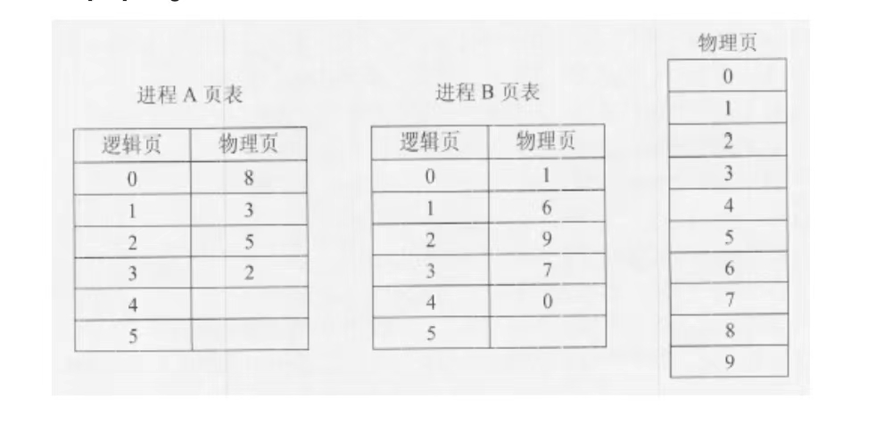
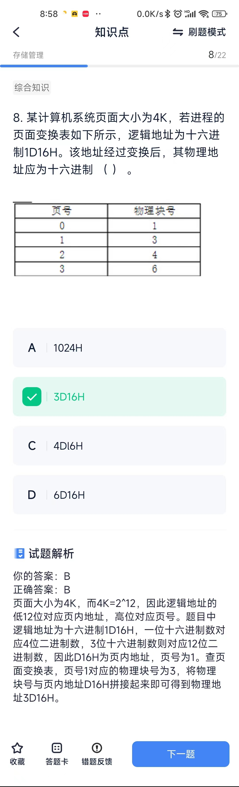
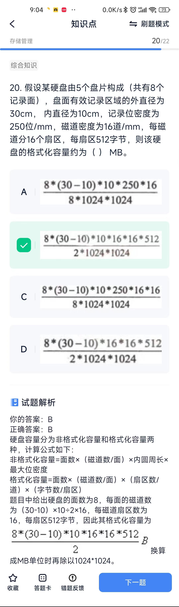

# 存储管理
## 概念
* 若某计算机系统的I/O接口与主存采用统一编址，则输入输出操作是通过**访存**指令来完成的。
* 磁盘调度管理中，先进行移臂调度寻找磁道，再进行旋转调度寻找扇区。

## 计算题
1. 某文件系统采用位示图（bitmap）记录磁盘的使用情况。若计算机系统的字长为64 位，磁盘的容量为1024GB，物理块的大小为4MB，那么位示图的大小需要（ ）个字。
> 计算机字长为64位，那么利用位示图表示时每个字能够表示64个物理块的存储情况； 磁盘的容量为1024GB，物理块的大小为4MB，则共有1024GB/4MB=（256*1024）个物理块。（注意单位转换） 256*1024个物理块，每64个物理块占用一个字，所以需要256*1024/64=4096个字。

2. 某操作系统采用分页存储管理方式， 下图给出了进程A和进程B的页表结构。 如果物理页的大小为1K字节， 那么进程A 中逻辑地址为1024 （十进制）用变量存 放在（）号物理内存页中。假设进程A的 逻辑页4与进程B的逻辑页5要共享物理页 4，那么应该在进程A页表的逻辑页4和进 程B页表的逻辑页5对应的物理页处分别填 （）。

> 逻辑地址是从0开始编址的，本题物理页的大小为1KB，而进程A逻辑地址为1024 的变量的逻辑页号为1，对应的物理页号为3。 假如进程A的逻辑页4与进程B的逻辑页5要共享的物理页4，那么应该在进程A页表的逻辑页4对应的物理页处填4，进程B页表的逻辑页5对应的物理页处也填4。

3. 内存地址

4. 逻辑地址转换物理地址

5. 扇区
