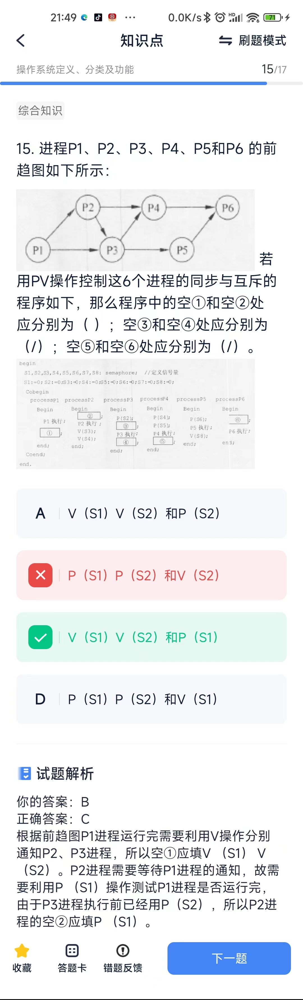

# 操作系统定义、分类及功能

## 概念
* 嵌入式操作系统的特点： 
1. 微型化，从性能和成本角度考虑，希望占用的 资源和系统代码量少； 
2. 可定制，从减少成本和缩短研发周期考虑，要求嵌入式操作系统能运行在不同的微处理器平 台上，能针对硬件变化进行结构与功能上的配 置， 以满足不同应用的需求；
3. 实时性，嵌入式操作系统主要应用于过程控制、数据采集、传输通信、多媒体信息及关键 要害领域需要迅速响应的场合，所以对实时性要求较高； 
4. 可靠性，系统构件、模块和体系结构必须达到应有的可靠性， 对关键要害应用还要提供容错和防故障措施；
5. 易移植性，为了提高系统的易移植性，通常采用硬件抽象层和板级支撑包的底层设计技术。

* 计算机系统由硬件和软件两部分组成。通常把 未配置软件的计算机称为裸机。直接使用裸机不仅不方便，而且将严重降低工作效率和机器 的利用率。操作系统（Operating System）目的是为了填补人与机器之间的鸿沟，即建立用 户与计算机之间的接口，而为裸机配置的一种系统软件。操作系统在计算机系统中的地位如下图：
> 应用软件（面向最终用户）->系统软件（面向应用软件开发人员、系统软件开发人员）->操作系统（面向系统软件开发人员）->计算机硬件（面向系统软件开发人员）
> 操作系统是裸机上的第一层软件， 是 对硬件系统功能的首次扩充。它在计算机系统 中占据重要而特殊的地位，所有其他软件，如 编辑程序、汇编程序、编译程序、数据库管理 系统等系统软件，以及大量的应用软件都是建 立在操作系统基础上的，并得到它的支持和取 得它的服务。从用户角度看， 当计算机配置了 操作系统后， 用户不再直接使用计算机系统硬 件，而是利用操作系统所提供的命令和服务去 操纵计算机，操作系统己成为现代计算机系统 中必不可少的最重要的系统软件， 因此把操作 系统看作是用户与计算机之间的接口。

* 实时是指计算机对于外来信息能够以足够快的速度进行处理，并在被控对象允许的时间范围内做出快速响应。因此，实时操作系统与分时操作系统的第一点区别是交互性强弱不同，分时系统交互型强，实时系统交互性弱但可靠性要求高；第二点区别是对响应时间的敏感牲强，对随机发生的外部事件必须在被控制对象规定的时间做出及时响应并对其进行处理；第三点区别是系统的设计目标不同，分时系统是设计成一个多用方的通用系统，交互能力强；而实时系统大都是专用系统。

* 嵌入式系统初始化过程：
1. 片级初始化：嵌入式微处理器的初始化，是一个纯硬件的初始化过程
2. 板级初始化：嵌入式微处理器以外的其他硬件设备的初始化
3. 系统级初始化：软件初始化为主，主要进行操作系统的初始化

* 操作系统有两个重要作用： 
1. 通过资管管理提高计算机系统的效率，操作系统是计算机系统的资源管理者，它含有对系统软/硬件资源实施管理的一组程序。 
2. 改善人机界面，向用户提供友好的工作环境。

* Windows XP操作系统支持FAT、FAT32或NTFS文件系统，所以利用“磁盘管理”程序可以对磁盘进行初始化、创建卷，并可以选择使用FAT、FAT32或NTFS文件系统格式化卷。

## 计算题
1. PV操作?
