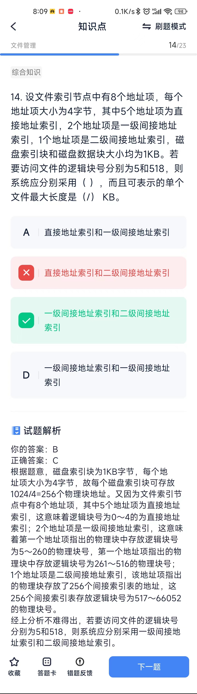

# 文件管理

## 概念
* 绝对路径从根路径开始；相对路径从当前目录下一级开始；全文件名包括所在路径（根路径）及其文件名称
* 若系统正在将**系统目录**文件修改的结果写回磁盘时系统发生崩溃，则对系统的影响相对较大。

## 计算题
1. 某文件系统采用多级索引结构。若磁盘块的大小为1 K字节，每个块号占3字节，那么采用二级索引时的文件最大长度为（ ）K字节。
> 根据题意，磁盘块的大小为1KB，每个块号需占3 B，因此一个磁盘物理块可存放1024/3=341个块号（取整）。 采用一级索引时的文件最大长度为： 341X1024/1024=341KB 采用二级索引时的文件最大长度为： 341X341X1024/1024=116281KB

2. TODO: 文件索引??
