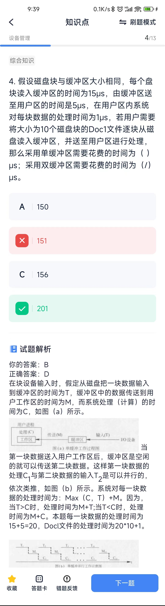
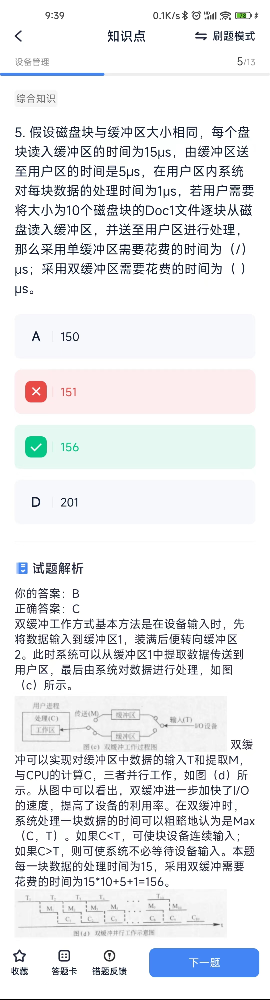
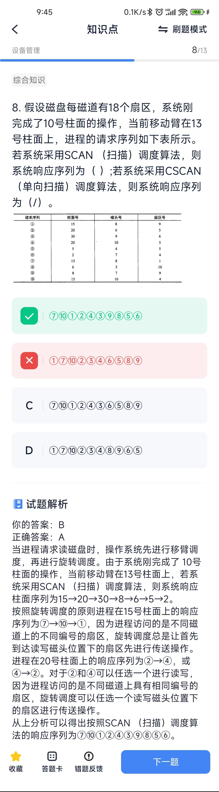

# 设备管理
## 概念
* IO设备管理具体层次从上往下分别为用户级I/O层、设备无关I/O层、设备驱动程序、中断处理程序、硬件。 
1. 硬件：完成具体的I/O操作。 
2. 中断处理程序：I/O完成后唤醒设备驱动程序。 
3. 设备驱动程序：设置寄存器，检查设备状态。 
4. 设备无关I/O层：设备名解析、阻塞进程、分配缓冲区。 
5. 用户级I/O层：发出I/O调用。

* 程序查询和中断方式都需要CPU来执行程序指令进行数据的输入和输出，DMA方式则不同，这是一种不经过CPU而直接从内存存取数据的数据交换模式。 程序查询方式是由CPU主动查询外设的状态，在外设准备好时传输数据。 
1. 中断方式是在外设准备好时给CPU发中断信号，之后再进行数据传输。在外设未发中断信号之前，CPU可以执行其他任务。 
2. 在DMA模式下，CPU只需向DMA控制器下达指令，让DMA控制器来处理数据的传送，数据传送完毕再把信息反馈给CPU即可。

* 在移臂调度算法中，**先来先服务和最短寻找时间优先**算法可能会随时改变移动臂的改动方向。

## 计算题
1. 某磁盘有100个磁道，磁头从一个磁道移至另一个磁道需要6ms。文件在磁盘上非连续存放，逻辑上相邻数据块的平均距离为10个磁道，每块的旋转延迟时间及传输时间分别为100ms和20ms，则读取一个100块的文件需要（ ）ms。
> 访问一个数据块的时间应为寻道时间加旋转延迟时间及传输时间之和。根据题意，每块的旋转延迟时间及传输时间共需120ms，磁头从一个磁道移至另一个磁道需要6ms，但逻辑上相邻数据块的平均距离为10个磁道，即读完一个数据块到下一个数据块寻道时间需要60ms。通过上述分析，本题访问一个数据块的时间T=120ms+60ms=180ms，而读取一个100块的文件共需要18000ms。

2. 磁盘缓存区？？

3. 磁盘扫描？？

> 若系统采用CSCAN （单向扫描）调度算法，在返程时是不响应用户请求的，因此系统的柱面响应序列为15→20→30→2→5→6→8。 可见，按照CSCAN （单向扫描）调度算法的响应序列为⑦⑩①②④③⑥⑤⑧⑨。