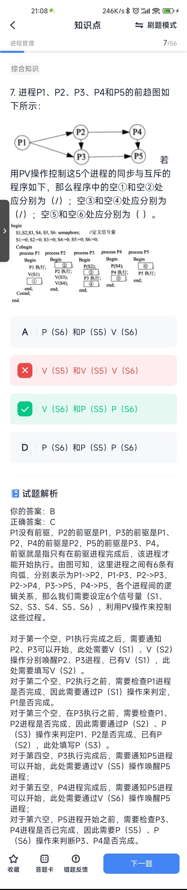

# 进程管理
## 概念
* **PV操作**利用信号量机制，是一种有效的进程同步与互斥工具，可以实现资源的互斥使用，所以“实现资源的互斥使用”正确。

* 常用的进程控制块的组织方式有链接方式和索 引方式： 
1. 采用链接方式是把具有同一状态的PCB，用其 中的链接字链接成一个队列。这样，可以形成 就绪队列、若干个阻塞队列和空自队列等。对其中的就绪队列常按进程优先级的高低排列， 把优先级高的进程的PCB排在队列前面。此 外，也可根据阻塞原因的不同而把处于阻塞状 态的进程的PCB排成等待I/O操作完成的认列和 等待分配内存的队列等。 
2. 采用索引方式是系统根据所有进程的状态建立 若干索引表。例如，就绪索引表、阻塞索引表 等，并把各索引表在内存的首地址记录在内存 的一些专用单元中。在每个索引表的表目中， 泪应状态的某个PCB在PCB表中的地

* 在同一进程中的各个线程都可以共享该进程所拥有的资源，如访问进程地址空间中的每一个虚地址；访问进程所拥有的已打开文件、定时器、信号量机构等，但是不能共享进程中某线程的栈指针。

* 在分时系统中是将把CPU的时间分成很短的时间片轮流地分配给各个终端用户，当系统中的用户数为n、时间片为q时，那么系统对每个用户的响应时间等于n*q。

* 在同一进程中的各个线程都可以共享该进程所拥有的资源，如访问进程地址空间中的每一个虚地址；访问进程拥有已打开文件、定时器、信号量机构等，但是不能共享进程中某线程的栈指针。

## 计算题
1. 某计算机系统中互斥资源R的可用数为8，系统中有3个进程P1、P2和P3竞争R，且每个进程都需要i个R，该系统可能会发生死锁的最小i值为（ ）

> M个进程，每个进程需要N个资源，不发生死锁要求总的资源R>M*(N-1)+1,代入技术i最小为4

2. TODO: 前驱图???
