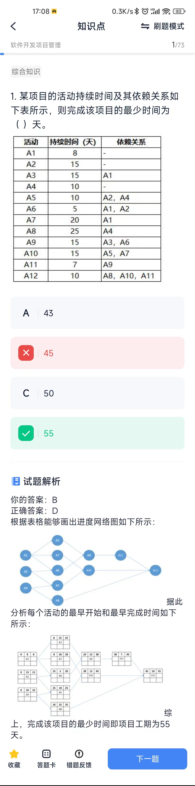
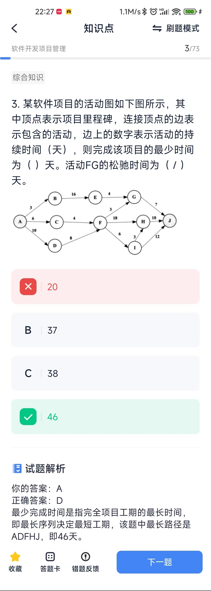
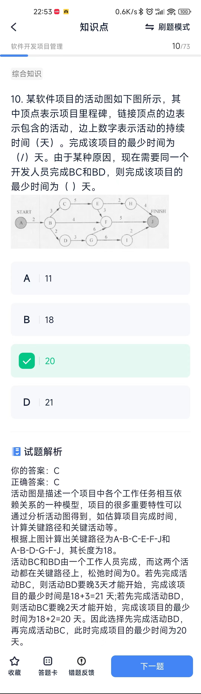
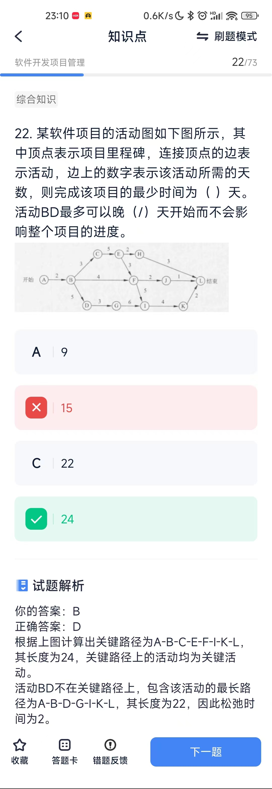
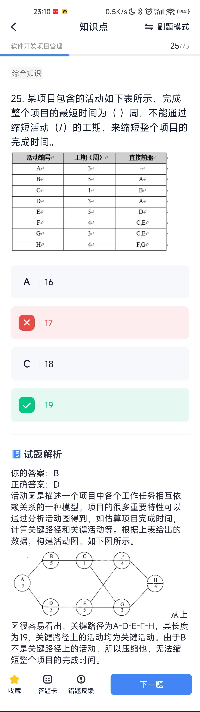

# 软件开发项目管理
## 概念
* COCOMOII模型也需要使用规模估算信息，在模型层次结构中有3种不同规模估算选择，即：对象点、功能点和代码行。
* 配置管理是软件开发过程的重要内容，贯穿软件开发的整个过程。其内容包括：软件配置标识、变更管理、版本控制、系统建立、配置审核和配置状态报告。
* 无主程序员组的开发小组，每两十开发人员之间都有沟通路径，因此，8人组成的开发小组沟通路径为完全连通无向图的边数，即 m = n（n-1）/2，其中n和m分另表示图的顶点数和边数。当n=8时，m==28。 主程序员组中，除了主程序员外的每个开发人员只能和主程序员沟通，因此8人组成的开发小组的沟通路径8-1=7。
* 结构化分析模型包括数据流图、实体联系图、状态迁移图和数据字典，因此这些模型是需求分析阶段的输出。而确定软件体系结构是在软件设计阶段进行的。
* 风险的优先级通常是根据风险暴露设定
* 软件配置管理SCM用于整个软件工程过程，其主要目标是标识变更、控制变更、确保变更正确的实现，报告变更。其主要内容包括：
1. 版本管理
2. 配置支持
3. 变更支持
4. 过程支持
5. 团队支持
6. 变化报告
7. 审计支持
8. 变更标识

> 软件变更控制是变更管理的重要内容，要有效进行变更控制，需要借助配置数据库和基线的概念。配置数据库一般包括开发库、受控库和产品库。

* Gantt图是一种简单的水平条形图，以日历为基准描述项目任务。水平轴表示日历时间线，如日、周和月等，每个条形表示一个任务，任务名称垂直的列在左边的列中，图中水平条的起点和终点对应水平轴上的时间，分别表示该任务的开始时间和结束时间，水平条的长度表示完成该任务所持续的时间。当日历中同一时段存在多个水平条时，表示任务之间的并发。 Gantt图能清晰地描述每个任务从何时开始，到何时结束，任务的进展情况以及各个任务之间的并行性。但它不能清晰地反映出各任务之间的依赖关系，难以确定整个项目的关键所在，也不能反映计划中有潜力的部分。
> 甘特图（Gantt图）是进行项目进度管理的一个重要工具，它对项目进度进行描述，显示在什么地方活动是并行进行的，并用颜色或图标来指明完成的程度。使用该图，项目经理可以清晰的了解每个任务的开始和截止时间，哪些任务可以并行进行，哪些在关键路径上，但是不能很清晰的看出各任务之间的依赖关系。
* 定义风险参照水准是风险评估的一类技术，对于大多数软件项目来说成本、速度和性能是三种典型的风险参照水准。
* 风险避免即放弃或不进行可能带来损失的活动或工作。例如，为了避免洪水风险，可以把工厂建在地势较高、排水方便的地方，这是一种主动的风险控制方法。 
* 风险监控是指在决策主体的运行过程中，对风险的发展与变化情况进行全程监督，并根据需要进行应对策略的调整。 
* 风险管理是指在一个肯定有风险的环境里把风险减至最低的管理过程。对于风险我们可以转移，可以规避，但不能消除。
* 在软件开发过程中进行风险分析时，**风险控制**活动的目的是辅助项目组建立处理风险的策略，有效的策略应考虑风险避免、风险监控、风险管理及意外事件计划。
* 风险预测从风险发生的可能性大小以及风险发生所产生的后果是否严重两个方面评估风险。
* 用于系统开发人员与项目管理人员在项目期内进行沟通的文档主要有系统开发计划，包括工作任务分解表、PERT图、甘特图和预算分配表等。总体规划和开发合同用于与系统分析人员在系统规划和系统分析阶段的沟通。测试计划用于系统测试人员与系统开发人员之间的沟通。
* 系统开发人员与项目管理人员在项目期内进行沟通的文档主要有系统开发计划、系统开发月报以及系统开发总结报告等项目管理文件。

## 计算题
TODO: 各种时间的计算方法?
1. 项目持续时间

2. 软件项目活动图

> 松弛时间：最少完成时间是指完全项目工期的最长时间，即最长序列决定最短工期，该题中最长路径是ADFHJ，即46天。 因此FG最早开始时间为：ADF=18；最迟开始时间为：46-7-3=36; 所以FG的松弛时间为：36-18=18；注意关键路径上的活动松弛时间为0

3. 项目活动变体

