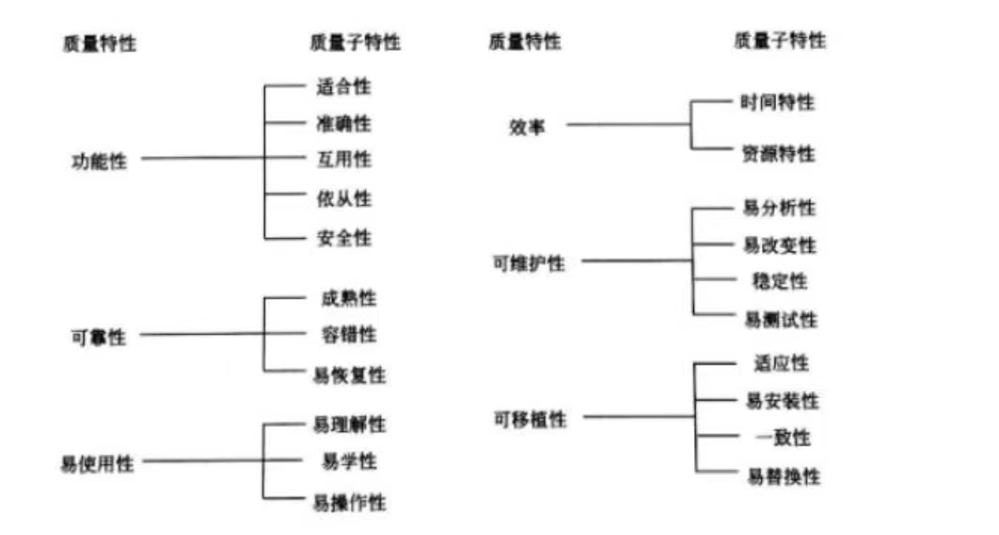

# 软件质量管理
## 概念
* 质量特性：

* 模块结构评审时，主要包括以下方面的评审： 
1. 控制流结构：规定了处理模块与处理模块之间的流程关系。检查处理模块之间的控制转移关系与控制转移形式（调用方式）。 
2. 数据流结构：规定了数据模块是如何被处理模块进行加工的流程关系。检查处理模块与数据模块之间的对应关系；处理模块与数据模块之间的存取关系，如建立、删除、查询、修改等。 
3. 模块结构与功能结构之间的对应关系：包括功能结构与控制流结构的对应关系；功能结构与数据流结构的对应关系；每个模块的定义（包括功能、输入与输出数据）。

* 软件复杂性度量是软件度量的一个重要分支。 对于软件复杂性度量的主要参数有： 
1. 规模，即总共的指令数，或源程序行数。 
2. 难度，通常由程序中出现的操作数的数目所决定的量来表示。 
3. 结构，通常用与程序结构有关的度量来表示。 
4. 智能度，即算法的难易程度。

* McCall软件质量模型从软件产品的运行、修正和转移三个方面确定了11个质量特性，其中运行方面包含了正确性、可靠性、效率、完整性、使用性这些质量特性。修正方面包含了维护性、测试性、灵活性这3个质量特性。转移方面包含了维护性移植性、复用性、共运行性这3个质量特性。

## 计算题
1. McCable度量法

