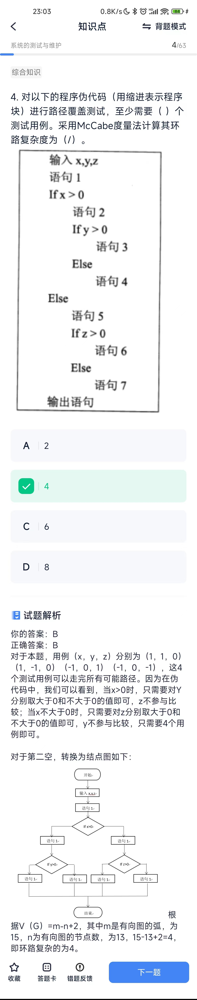

# 系统的测试与维护
## 概念
* 在系统运行过程中， 软件需要维护的原因是多 样的，根据维护的原因不同，可以将软件维护分为以下四种： 
1. 改正性维护。为了识别和纠正软件错误、改正软件性能上的缺陷、排除实施中的误使用，应当进行的诊断和改正错误的过程就称为改正性 维护。 
2. 适应性维护。在使用过程中，外部环境（新的硬、软件配置）、数据环境（数据库、数据格式、数据输入/输出方式、数据存储介质）可能发生变化。为使软件适应这种变化，而去修改 软件的过程就称为适应性维护。 
3. 完善性维护。在软件的使用过程中，用户往往 会对软件提出新的功能与性能要求。为了满足这些要求，需要修改或再开发软件，以扩充软件功能、增强软件性能、改进加工效率、提高软件的可维护性。这种情况下进行的维护活动 称为完善性维护。 
4. 预防性维护。这是指预先提高软件的可维护 性、 可靠性等， 为以后进一步改进软件打下良好基础。

* 辅助软件维护过程中的活动的软件称为“软件维护工具”，它辅助维护人员对软件代码及其文档进行各种维护活动。软件维护工具主要有： 
1. 版本控制工具； 
2. 文档分析工具； 
3. 开发信息库工具
4. 逆向工程工具； 
5. 再工程工具； 
6. 配置管理支持工具。

* 在设计测试用例时应考虑输入数据和预期输出结果、在设计测试用例时，应该包括合理的输入条件、在设计测试用例时，应该包括不合理的输入条件选项都与测试用例的基本概念相关，每个测试用例应该包含输入数据和预期输出结果。在设计测试用例时，要包含合理的输入和不合理的输入。因此，这三个选项均正确。 软件测试的目的是发现更多的错误，而不是证明软件的正确性。

* 集成测试策略
1. 顶向下集成优点;较早地验证了主要控制和判 断点;按深度优先可以首先实现和验证一个完整 的软件功能;功能较早证实， 带来信心;只需一个 驱动，减少驱动器开发的费用;支持故障隔离。 缺点;柱的开发量大;底层验证被推迟;底层组件测 试不充分。适应于产品控制结构比较清晰和稳 定;高层接口变化较小;底层接口未定义或经常可 能被修改;产口控制组件具有较大的技术风险， 需要尽早被验证;希望尽早能看到产品的系统功 能行为。 
2. 自底向上集成优点:对底层组件行为较早验证 工作最初可以并行集成，比自顶向下效率高;减 少了桩的工作量;支持故障隔离。缺点:驱动的开 发工作量大;对高层的验证被推迟，设计上的错 误不能被及时发现。适应于底层接口比较稳定; 高层接口变化比较频繁;底层组件较早被完成。 

* 软件测试的基本目标是为了发现软件中的错误，但软件测试分为几个不同的阶段，每个阶段的侧重点是有所不同的。
1. 单元测试主要是发现程序代码中的问题，针对详细设计和软件实现阶段的工作进行的；全局数据结构不是单元测试主要检测的内容
2. 集成测试验证系统模块是否能够根据系统和程序设计规格说明的描述进行工作，即模块以及模块之间的接口的测试
3. 系统测试则是验证系统是否确实执行需求规格说明中描述的功能和非功能要求，因此测试目标在需求分析阶段就已经定义。

* 系统的可维护性的评价指标包括：可理解性、可测试性、可修改性。 
1. 可理解性：指别人能理解系统的结构、界面、功能和内部过程的难易程度。模块化、详细设计文档、结构化设计和良好的高级程序设计语言等，都有助于提高可理解性。 
2. 可测试性：诊断和测试的容易程度取决于易理解的程度。 
3. 可修改性：诊断和测试的容易程度与系统设计所制定的设计原则有直接关系。模块的耦合、内聚、作用范围与控制范围的关系等，都对可修改性有影响。

* 逆向工程产品设计可以认为是一个从产品到设计的过程。简单地说，逆向工程产品设计就是根据已经存在的产品，反向推出产品设计数据（包括各类设计图或数据模型）的过程。这个过程一般是在软件交付使用之后进行，所以是在原软件生命周期的软件维护阶段进行。

* 黑盒测试也称为功能测试，在完全不考虑软件的内部结构和特性的情况下来测试软件的外部特性。常用的黑盒测试技术包括等价类划分、边界值分析、错误猜测和因果图的报告。白盒测试也称为结构测试，根据程序的内部结构和逻辑来设计测试用例，对程序的执行路径和过程进行测试，检查是否满足设计的需要。常用的白盒测试技术包括逻辑覆盖和基本路径测试。

* 软件维护是软件生命周期最长的一段，相对于软件开发任务而言，软件维护工作要更加复杂。

## 计算题
1. McCabe
