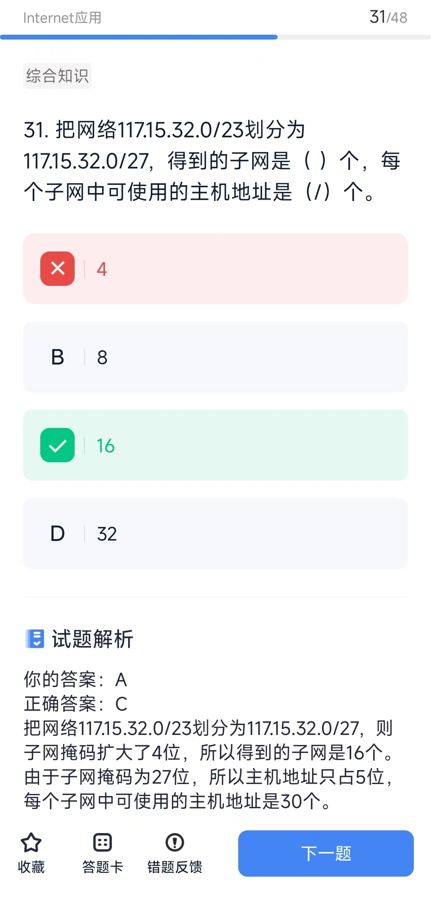

# Internet应用
## 概念
* 域名解析流程： 
1. 客户机提出域名解析请求，并将该请求发送给本地的域名服务器。 
2. 当本地的域名服务器收到请求后，就先查询本地的缓存，如果有该纪录项，则本地的域名服务器就直接把查询的结果返回。 
3. 如果本地的缓存中没有该纪录，则本地域名服务器就直接把请求发给根域名服务器，然后根域名服务器再返回给本地域名服务器一个所查 询域（根的子域）的主域名服务器的地址。 
4. 本地服务器再向上一步返回的域名服务器发送请求，然后接受请求的服务器查询自己的缓存，如果没有该纪录，则返回相关的下级的域 名服务器的地址。 
5. 重复第4步，直到找到正确的纪录。 
6. 本地域名服务器把返回的结果保存到缓存， 以备下一次使用，同时还将结果返回给客户机。

* DHCP协议的功能是自动分配IP地址；FTP协议的作用是文件传输，使用的传输层协议为TCP。

## 计算题
* 分配给某公司网络的地址块是210.115.192.0/20，该网络可以被划分为（）个C类子网。
> 正确答案：C 由于分配给公司网络的地址块是210.115.192.0/20，留给子网掩码的比特数只有4位，所以只能划分为16个C类子网，这16个C类子网的子网号为11000000〜11001111，即192〜207，所以210.115. 210. 0不属于该公司的网络地址。

* 子网
